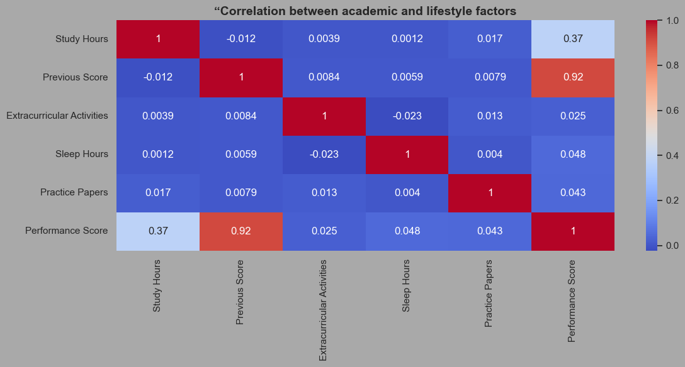
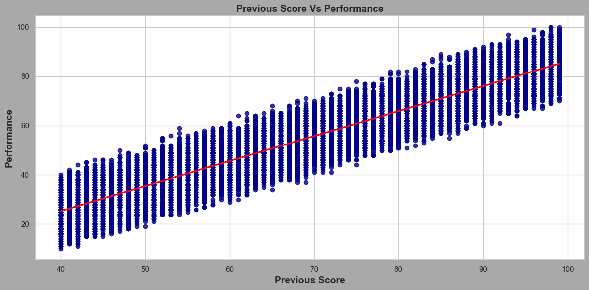
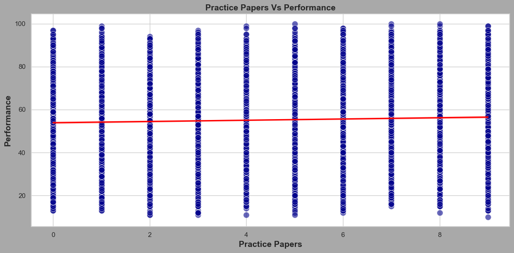

# 📊 Student Performance Analysis

## 📌 Project Overview
This project analyzes a student performance dataset to identify key factors influencing academic results using Python.

The goal is to move beyond assumptions and uncover data-driven insights about student habits and performance.

---

## 🧰 Tools & Technologies
- Python
- Pandas
- NumPy
- Seaborn
- Matplotlib
- Jupyter Notebook

---

## 📊 Key Insights
- 🔴 Previous Score shows a strong correlation with Performance Score (r ≈ 0.92)
- 🟡 Sleep Hours show very weak correlation (r ≈ 0.05)
- 🟡 Practice Papers show very weak correlation (r ≈ 0.04)

---

## 📈 Visualizations

### Heatmap

### Previous Score vs Performance (Regression)

### Practice Papers vs Performance

---

## 💡 Conclusion
Previous academic performance is the strongest predictor of future results, while short-term effort variables show minimal impact.

---
## for more information you can check StudentPerformance.csv

---

## 👨‍💻 Author
Marjila Rahmaty 